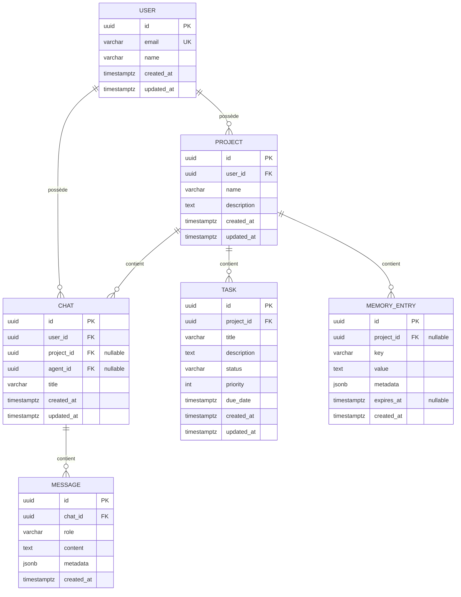

# Base de données

L'application utilise **PostgreSQL** comme base de données principale, avec **Neon Serverless Postgres**.

## Drizzle ORM

Les interactions avec la base de données sont gérées par **Drizzle ORM**.
- **Schéma** : Le schéma de la base de données est défini dans `lib/db/schema.ts`.
- **Migrations** : Les scripts de migration se trouvent dans `lib/db/migrate.ts` et `lib/db/migrations/`.

---

## 1. Schéma entité-relation



---

## 2. Liste complète des tables

| Table | Nom physique | Rôle |
|---|---|---|
| Utilisateurs | `user` | Comptes utilisateurs, authentification et profil |
| Projets | `project` | Espaces de travail organisés par utilisateur |
| Chats | `chat` | Conversations historiques avec agents IA |
| Messages | `message` | Contenu individuel des échanges dans un chat |
| Tâches | `task` | Items de suivi et gestion de travail par projet |
| Entrées mémoire | `memory_entry` | Mémoire persistante longue durée pour IA |

---

## 3. Conventions de nommage

✅ **Règles uniformes appliquées**:
- 🐍 `snake_case` pour **tous** les noms de tables, colonnes et index
- Clés primaires systématiquement nommées `id` (type `uuid`)
- Clés étrangères: `{table_singulier}_id`
- Horodatages obligatoires: `created_at`, `updated_at`
- Pas de préfixes, pas d'abréviations ambigües
- Noms au singulier pour les tables (ex: `user` pas `users`)
- Index: `idx_{table}_{colonnes}`

---

## 4. Guide des migrations

### Commandes disponibles
```bash
# Générer migration depuis le schéma TypeScript
npx drizzle-kit generate

# Appliquer migrations en attente
npx drizzle-kit migrate

# Voir statut des migrations
npx drizzle-kit status

# Ouvrir studio Drizzle
npx drizzle-kit studio
```

### Workflow correct
1. 🔧 Modifier `lib/db/schema.ts`
2. ✅ Générer migration: `drizzle-kit generate`
3. 👀 Vérifier le fichier SQL généré dans `migrations/`
4. 🚀 Appliquer en local puis sur les environnements

⚠️ **Jamais modifier** une migration déjà appliquée. Toujours créer une nouvelle migration.

---

## 5. Bonnes pratiques pour les requêtes

✅ À faire:
- Utiliser systématiquement l'ORM Drizzle (pas de SQL brut)
- Toujours paginer les requêtes retournant des listes
- Sélectionner explicitement les colonnes nécessaires
- Utiliser des transactions pour des opérations multiples
- Valider toutes les entrées avant exécution

❌ À éviter:
- `SELECT *` systématiquement
- Requêtes N+1 (utiliser `with()` pour les relations)
- Boucles avec requêtes individuelles
- Filtres sur colonnes non indexées

---

## 6. Index et optimisations

### Index existants
| Table | Colonnes | Type |
|---|---|---|
| `project` | `user_id` | B-Tree |
| `chat` | `user_id`, `created_at DESC` | Composé |
| `message` | `chat_id`, `created_at ASC` | Composé |
| `task` | `project_id`, `status`, `priority` | Composé |
| `memory_entry` | `project_id`, `key` | Unique |

### Optimisations
- Utiliser `jsonb` pour données structurées avec index GIN si nécessaires
- Horodatages avec `timestamptz` systématiquement
- Partitionnement disponible pour tables à fort volume (messages)
- `VACUUM ANALYZE` automatisé via Neon

---

## 7. Procédures de sauvegarde

### Sauvegardes automatiques
- ✅ Neon réalise des sauvegardes incrémentales **chaque minute**
- ✅ Rétention: 30 jours pour les environnements de production
- ✅ Point-in-Time Recovery (PITR) disponible

### Procédure manuelle
```bash
# Exporter base complète
pg_dump $DATABASE_URL > backup_$(date +%Y%m%d).sql

# Restaurer
psql $DATABASE_URL < backup_YYYYMMDD.sql
```

### Routine
- Vérifier intégrité sauvegardes tous les 15 jours
- Tester procédure de restauration mensuellement
- Conserver sauvegardes hors site pour incidents majeurs
